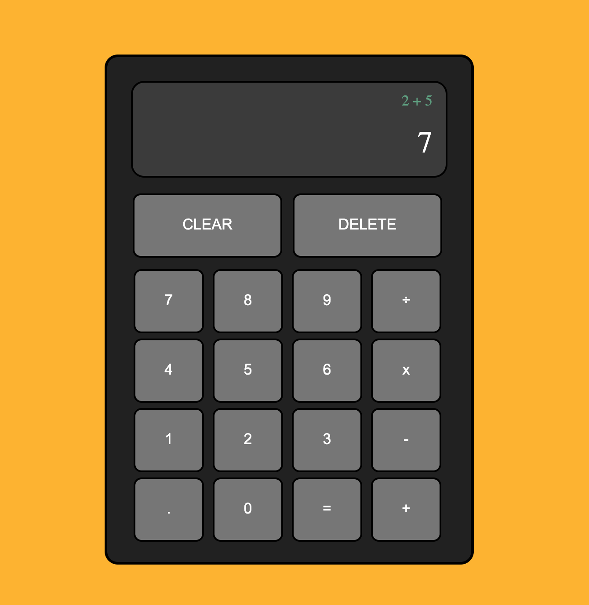

# Calculator

An online calculator with basic arithmetic operations built using HTML5, CSS3 and JavaScript. It is controlled by your mouse. To tyr your own calculations check out the live demo [here](https://kamilkhxn.github.io/Calculator/).

### What I Learned
* Array manipulation
    * .slice()
    * .join()
    * .push()
* Debugging using JavaScript console in tbe browser 
    * console.log()
- GitHub branches: 
    * git checkout -b ==> makes a new branch and switches you into it
    * NOTE make sure to push the branch to remote repo (Github)

## Improvements
* keyboard functionality 

## Resources    
[The Odin Project - DOM Manipulation ](https://www.theodinproject.com/paths/foundations/courses/foundations/lessons/dom-manipulation)

[The Odin Project - DOM Manipulation ](https://developer.mozilla.org/en-US/docs/Web/JavaScript/Reference/Global_Objects/Array)

